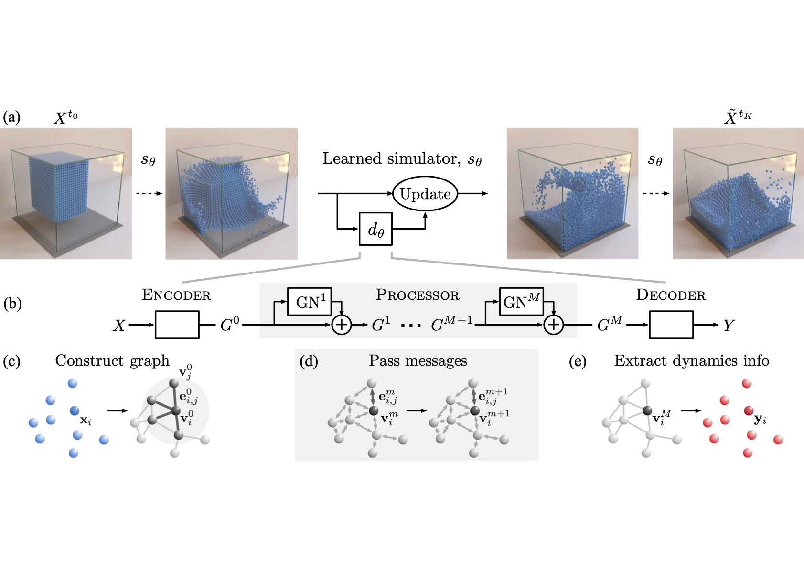

# [Learning to Simulate Complex Physics with Graph Networks](https://arxiv.org/abs/2002.09405)
Authors: Alvaro Sanchez-Gonzalez, Jonathan Godwin, Tobias Pfaff, Rex Ying, Jure Leskovec, Peter W. Battaglia, ICML 2020.  
Presenters: **Yuanhao Xiong**, **Xiangning Chen**, **Li-Cheng Lan**  
Codes: (https://github.com/deepmind/deepmind-research/tree/master/learning_to_simulate)  
Video site: (https://sites.google.com/corp/view/learning-to-simulate)

## Introduction
Realistic simulators of complex physics are invaluable to many scientific and engineering disciplines. However, building a high-quality simulator is faced with significant difficulties, such as substantial computational resources, lack of knowledge of underlying physics and parameters, and the like. An attractive alternative to traditional simulators is to use machine learning to train simulators directly from observed data. In this paper, a powerful machine learning framework forlearning to simulate complex systems from data — “GraphNetwork-based Simulators” (GNS) is presented. Experiments have shown that GNS can learn to accurately simulate a wide range of physical systems, generalized well to much larger systems and longer time scales than those on which it was trained.

## Related works
This paper focus on particle-based simulation, where states are represented as a set of particles that encode mass, material, movement, etc. within local regions of space. Dynamics are computed on the basis of particles’ interactions within their local neighborhoods. Besides, recently graph networks have proven effective at learning forward dynamics in various settings that involve interactions between many entities. For example, interaction networks. And there are two baseline methods mentioned in this paper, DPI and CConv. They are both designed for specific settings and authors made a comparison in the experiments.

## Method

- Encoder: embeds the raw state representations as a latent graph
- Processor: message passing within the graph
- Decoder: extract the required dynamics information

## Experimental Results

## Conclusion
- A powerful machine learning framework GNS is presented, based on particle-based representations of physics and learned message-passing on graphs
- With a simple architecture, GNS can learn to simulate dynamics of complex physics with tens of thousands of particles over thousands time steps.
- GNS is more accurate, and has better generalization than previous approaches

## Pros and Cons
- Pros
    - Simple but powerful, good generalization
    - Robust to hyperparameter choicesacross various evaluation metrics
- Cons
    - GNS is particle-based and it is not clear how to extend it to data represented by other forms
    - Using only basic physical knowledge about position, velocity, and acceleration
    - Training with only one-step loss function, no guarantee for good performance in the long term
    - Computationally inefficient

