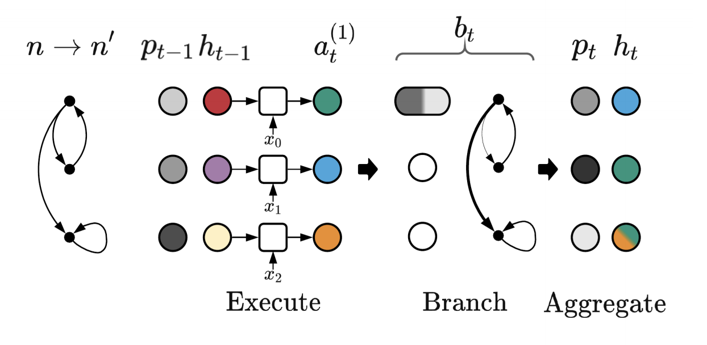
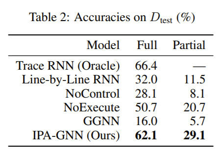
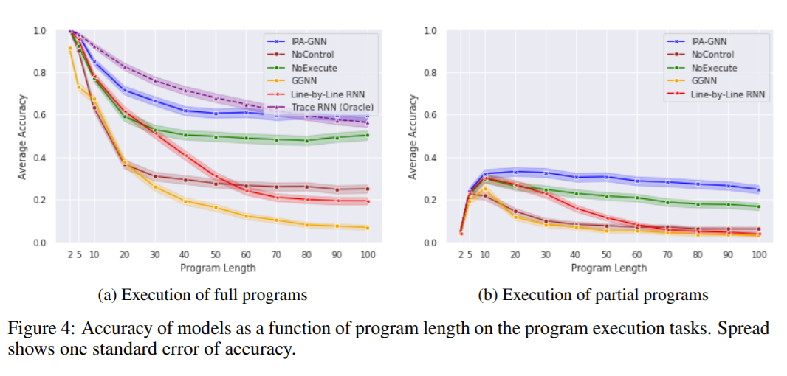

# Introduction

# Approach

The authors try to mimic the causal structure of an interpreter with control flow. The most natural model to do that is the family of recurrent neural networks. Executing straight line code can be done by a simple RNN which they call the Line-by-Line RNN with the instruction pointer n_t just being equal to t (step of interpretation). Changing the definition of the instruction pointer n_t results in a family of models called the Instruction Pointer RNNs (IP-RNNs). Executing branch decisions using an oracle that reveals the ground truth branches results in a model called the Trace RNN. Using a hardmax over a Dense Layer applied on the hidden state yields Hard IP-RNN. Since hardmax is non-differentiable, a continuos relaxation to softmax yields the Instruction Pointer Attention Graph Neural Network (IPAGNN).

For IPAGNN, the instruction pointer is replaced by a soft instruction pointer which models a probability distribution over the possible statements. Each RNN cell generates a state proposal for a timestamp t and statement n. The branch decisions are also changed to a soft branch decision, calculated by a softmax over a Dense layer applied on top of the state proposal. This yields the probability to go to a certain statement from the existing statement. The hidden state for a statement at a step is generated by the sum of product of the probability of moving to a particular statement as given by the soft branch decision, the probability of executing the preceding statement given by the soft instruction pointer at the previous timestamp and the state proposal for all preceding statements of the statement of interest. This way, the model learns the control flow of the graph thus mimicking the causal structure of the interpreter. This also improves systematic generalization.

The IPAGNN is closely related to graph neural networks, especially the Gated Graph Neural Networks (GGNN). IPAGNN differs in the steps of control and execution, and one can get the GGNN from IPAGNN by replacing these two steps. Replacing one of them yields a model in between, and the authors compare the series of models from IPAGNN to GGNN to evaluate the performance of the specific changes.

# Experiment

Data Generation:

In this paper, each program in data sets is generated by probabilistic grammar and these programs only capture a subset of the Python programming language. To be more specific, each program in date set only allows multi-digit arithmetic for variable v0; if-else statement with variable v0 and while-loops statement. Furthermore, the range of the value is limited by 1000 and other variable v1, to v9, only appear in while loops. For each generated program, the corresponding partial programs is constructed by masking one expression
statement. Here, the masked statement is uniform random chosen from all non-control flow statements and the partial program remain same execution behavior as the full program.
The training data includes 5 million generated programs with program length equal to 10 and the test data sets include 4500 programs with program length equal from 20, 30, to 100.

Training models:

For both full programs and partial programs, this paper evaluates the IPA-GNN model against other baseline models, such as Line-by-Line RNN, R-GAT, No-Control model , NoExecute model , and GGNN model. For the Trace RNN, it requires access to a trace oracle and we only implement it on full program tasks. For each model, this paper use adam optimizer with standard cross-entropy loss, train with different parameter (Hidden layer : 200,300; Learning rate: 0.003, 0.001, 0.0003, 0.0001) and choose the best model parameters by cross-validation.

Experiment results:

The following graphs shows the experiemtn results for different model.

# Pros and Cons

### Pros

- Better systematic generalization by replicating the causal structure of the interpreter.
- Combining RNNs and GNNs help represent the sequential and graphical nature of code.
- The model learns discrete branch decisions that match the ground truth branching made by the interpreter.
- The model also learns short-circuit execution for loops and repetitions.

### Cons

- The model only represents a subset of programs bounded by a small set of rules.
- Deviating from these rules would render the model unusable.
- Model path for longer length programs may suffer from common RNN problems like vanishing gradients and loss of memory.
